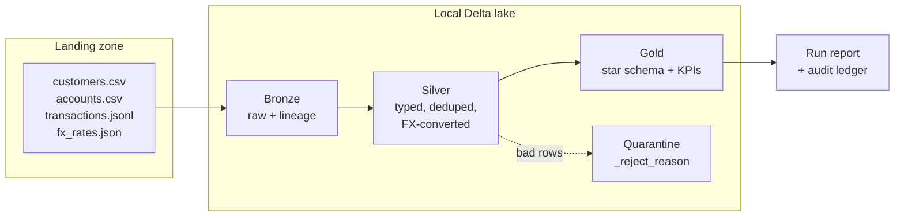
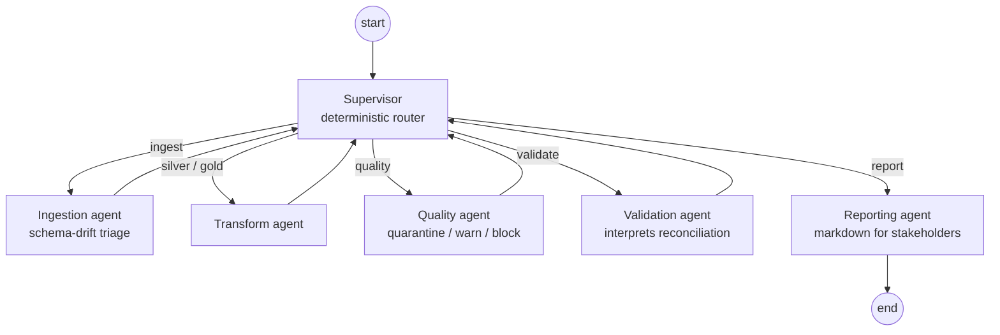

# Agents + Data Engineering: an agent-operated medallion lakehouse

[](../../actions/workflows/ci.yml)


**Lakekeeper** is an end-to-end data engineering project where the pipeline is not only
built, but *operated*, by AI agents. Deterministic Python/SQL transformations move
synthetic core-banking data through a bronze/silver/gold Delta lakehouse, while a team of
LangGraph agents supervises the run: they triage schema drift, decide what to do with
failed data-quality rules, recover from step failures, validate the results and write a
run report for stakeholders.

I built this to answer a question I kept running into as a data engineer: **where does an
LLM actually add value in a data platform?** My answer here: not in the transformations
(those must stay deterministic and testable), but at the escalation points where today a
human gets paged. Everything in this repo is organized around that idea.

Two things worth knowing before you clone:

- **It runs 100% locally and needs no API key.** Without `ANTHROPIC_API_KEY` the agents
  use deterministic mock policies that follow the same graph, so the demo, the tests and
  CI all work out of the box.
- **It is built to translate to Databricks.** Real Delta tables via delta-rs, portable
  SQL, MERGE semantics, declarative quality rules. The mapping is documented in
  [docs/databricks_mapping.md](docs/databricks_mapping.md).

## The pipeline



A daily drop of synthetic Bolivian banking data (customers, accounts, transactions in
BOB/USD, FX rates) lands as CSV/JSONL/JSON and flows into a star schema
(`dim_customer`, `dim_account`, `dim_date`, `fact_transactions`) plus a KPI mart
(`kpi_daily`: volumes, fraud-flag rate, late transactions, quarantine rate).

Nothing is ever deleted: rows that fail error-severity quality rules move to a quarantine
layer with their `_reject_reason`, and a reconciliation step proves every run that
`bronze = silver + quarantine`, both in row counts and in amounts.

## The agents



The design rule: **deterministic router, LLM only on escalation.** The supervisor
advances a fixed happy-path plan in code, so a clean run makes zero LLM calls. Claude is
consulted only when something goes off-plan:

| Situation | Agent | The LLM chooses between |
|---|---|---|
| A landing file's columns deviate from the contract | ingestion | `skip_file` / `ingest_aligned` / `abort` |
| Data-quality rules fail (it sees sample bad rows) | quality | per rule: `quarantine` / `warn_and_keep` / `block` |
| A pipeline step throws | supervisor | `retry` / `skip_step` / `abort` |
| Reconciliation mismatch or KPI anomaly | validation | `pass` / `pass_with_warnings` / `fail` |

Every decision is structured output over a closed action space (Pydantic + `Literal`),
with the rationale recorded in a run ledger (`run_log_*.json`). Retry counts and the LLM
call budget are enforced in code, never left to the model. If the API is unavailable or
the budget runs out, deciders degrade to the mock policies and the run finishes anyway.

## Quickstart

```bash
git clone https://github.com/Sheila-RV/agents_data_engineering.git
cd agents_data_engineering
python -m venv .venv && source .venv/bin/activate   # Windows: .venv\Scripts\activate
pip install -e ".[dev]"

python -m lakekeeper demo                 # clean run: generate -> pipeline -> KPIs
python -m lakekeeper demo --chaos high    # messy run: watch the agents work
pytest                                    # 32 tests, no API key needed
```

To run with live Claude decisions instead of the mock policies:

```bash
cp .env.example .env                      # set ANTHROPIC_API_KEY
python -m lakekeeper generate --chaos high
python -m lakekeeper run --live
```

Live runs use `claude-sonnet-5` for decisions and `claude-haiku-4-5` for the report,
hard-capped at 15 LLM calls per run (roughly $0.05 for a clean run, $0.20 for a chaos run).

## A chaos run, step by step

`--chaos high` injects seeded, reproducible problems: duplicated transactions, null
amounts and document IDs, late-arriving records, a renamed column in the accounts feed
(`status` -> `estado`), a missing USD rate in the FX file, and a 5x fraud-flag spike.
This is what the agents do with it:

```text
agent ingestion decided ingest_aligned   <- schema drift triaged, nothing lost
  dq error silver.customers: doc_id_not_null (25/500 rows)
agent quality decided doc_id_not_null->quarantine
  dq error silver.accounts: customer_exists (37/773 rows)       <- FK cascade
  dq error silver.transactions: account_exists (233/5000 rows)  <- FK cascade
  dq warn  silver.transactions: fx_rate_missing (937/5000 rows)
  recon row_conservation_transactions ok   bronze 5000 = silver 4719 + quarantine 281
  recon fraud_rate_baseline MISMATCH       6.45% vs threshold 1.5%
agent validation decided pass_with_warnings -- fraud-flag spike flagged for review
```

The full output of this run (console, markdown report, JSON ledger) is committed under
[examples/run_2026-07-01_chaos-high/](examples/run_2026-07-01_chaos-high/).

## Tech stack and key decisions

| Area | Choice | Why |
|---|---|---|
| Storage | Delta Lake via delta-rs | Real Delta tables, identical format to Databricks, no JVM required |
| Silver transforms | Polars | Fast, typed, runs anywhere `pip install` works |
| Gold models | Plain SQL files on DuckDB | Reviewable, diffable, near copy-paste to Databricks SQL |
| Data quality | Declarative YAML rules + small engine | The LLM interprets findings; it never invents checks |
| Orchestration | LangGraph `StateGraph` | Supervisor + 5 workers; the state doubles as the audit trail |
| LLM | Claude via `langchain-anthropic` | Structured output, closed action spaces, code-enforced budgets |
| CLI | Typer + Rich | `generate` / `run` / `report` / `demo` |

Architecture notes I care about:

- Strict boundary: `pipeline/` never imports from `agents/`. Agents act only through
  [agents/tools.py](src/lakekeeper/agents/tools.py).
- Idempotent by construction: bronze is append-only with lineage columns, silver dedupes
  and MERGE-upserts on business keys. Re-running a date converges to the same state.
- More detail in [docs/architecture.md](docs/architecture.md), the
  [data dictionary](docs/data_dictionary.md) and the [ADRs](docs/decisions/).

## Databricks

The project is engine-portable on purpose: same storage format, same MERGE semantics,
portable SQL, and quality rules that map to Lakeflow expectations. See
[docs/databricks_mapping.md](docs/databricks_mapping.md) for the concept-by-concept map,
plus illustrative notebooks and an Asset Bundle job under [databricks/](databricks/).

## Repository layout

```
src/lakekeeper/
├── datagen/          # seeded synthetic banking data + chaos injection
├── pipeline/         # deterministic core: store, bronze, silver, gold, quality, reconciliation
│   ├── quality/rules/    # declarative DQ specs (YAML)
│   └── sql/              # gold star schema + KPI models
└── agents/           # LangGraph layer: supervisor, 5 agents, decision schemas, mock/live LLM
tests/                # unit + integration + full agent-graph runs (CI needs no secrets)
docs/                 # architecture, data dictionary, Databricks mapping, ADRs
databricks/           # illustrative notebooks + Asset Bundle job definition
examples/             # committed output of a canonical chaos run
```

## Roadmap

SCD Type 2 dimensions, streaming ingestion, multi-day backfills, LangSmith tracing,
and a small dashboard over the gold layer.

## About

Built by [**Sheila Rojas**](https://github.com/Sheila-RV) — Data & AI Engineer.
Questions or feedback: [shei.rv121@gmail.com](mailto:shei.rv121@gmail.com)

MIT licensed.
