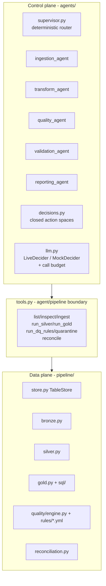

# Architecture

## The two-plane design

Lakekeeper separates the **data plane** (deterministic, testable transformation code)
from the **control plane** (agents that operate it). The dependency rule is strict:
`src/lakekeeper/pipeline/` never imports from `src/lakekeeper/agents/`. Agents reach the
lake only through the tool boundary ([agents/tools.py](../src/lakekeeper/agents/tools.py)).

## Data plane

### TableStore ([store.py](../src/lakekeeper/pipeline/store.py))

The single gateway to the lake. Four layers (`bronze`, `silver`, `gold`, `quarantine`),
three operations (`write` append/overwrite, `merge` upsert on business key, `sql` via
DuckDB with every table registered as `<layer>_<table>`). Keeping all engine details in
one small class is what makes the [Databricks mapping](databricks_mapping.md) practical.

Implementation notes:
- Writes/merges go through delta-rs (`polars.DataFrame.write_delta`).
- Reads go through `deltalake.DeltaTable` + pyarrow because polars' native delta scan
  percent-encodes spaces in Windows paths and then can't find its own parquet files.

### Bronze: verbatim + lineage

Everything lands as **strings** exactly as delivered, plus `_ingested_at`,
`_source_file`, `_run_id`. String-typing bronze keeps appends schema-stable no matter how
mangled a source file is, and makes drift detection purely name-based
(`CONTRACTS` in [bronze.py](../src/lakekeeper/pipeline/bronze.py)). Type casting and
cleaning happen in silver, so the original values are always preserved in bronze.

### Silver: typed, deduped, conformed

Casts use `strict=False`: garbage becomes `null`, and the DQ rules catch nulls - the
pipeline never dies mid-cast. Dedupe keeps the latest `_ingested_at` copy per business
key. Late records are detected by comparing the event date against the landing-file date
stamp. FX conversion joins the daily rate with a last-known-rate fallback per currency.
Writes are MERGE upserts, so re-running a date converges instead of duplicating.

### Quality: declarative rules, mechanical evaluation

Rules live in YAML ([quality/rules/](../src/lakekeeper/pipeline/quality/rules/)):
`not_null`, `unique`, `allowed_values`, `range`, `foreign_key` (which gives cascade
behavior: a quarantined customer orphans its accounts, which orphans their transactions),
and `fail_when` (any SQL expression). The engine produces a structured `DQReport` with
per-rule failure counts and sample offending rows. Quarantining moves rows to
`quarantine.<table>` tagged with `_reject_reason` - nothing is ever deleted, and the
conservation invariant (`bronze keys = silver + quarantine`) is checked every run.

### Gold: SQL files

Star schema + KPI mart as plain `.sql` files executed by DuckDB over the silver tables.
SQL-as-files keeps the models reviewable, diffable, and portable to Databricks SQL.

### Reconciliation

Deterministic cross-layer checks: row conservation per table, amount conservation
silver → fact, orphan facts, fraud-flag rate vs baseline. Code computes the numbers;
the validation agent only interprets them.

## Control plane

### State = audit trail

`PipelineRunState` accumulates step results, DQ reports, failures, and every LLM
decision with its rationale. The final state is persisted as `run_log_<run_id>.json`,
so questions like "why is this row in quarantine?" can always be answered from the
ledger.

### Supervisor: deterministic router, LLM on escalation

The happy path is a fixed list of steps advanced in code. A clean run makes **zero** LLM
calls. The LLM is consulted exactly when:

1. a worker leaves a `pending_failure` (any exception, via the `failsafe` wrapper),
2. DQ rules fail at error severity,
3. a landing file drifts from its schema contract,
4. reconciliation mismatches.

### Bounded decisions, code-enforced budgets

Decisions are Pydantic models with `Literal` action fields
([decisions.py](../src/lakekeeper/agents/decisions.py)) obtained via LangChain structured
output. The model cannot invent an action, and the two loops it could theoretically cause
are bounded in code: step retries decrement `retries_remaining` (a `retry` decision with
an empty budget becomes `abort`), and `CallBudget` hard-caps LLM calls per run - beyond
the cap, deciders degrade to mock policies rather than failing the run.

### Mock mode

`MockDecider` implements conservative deterministic policies for every schema (quarantine
error failures, retry-then-abort, ingest-aligned on drift, fail on integrity mismatch).
It is the default when no API key is configured: anyone can run the full demo, CI
exercises the complete graph without secrets, and output is reproducible. Live and mock
runs traverse the same graph paths.

## Testing strategy

- **Unit**: datagen determinism, store roundtrip/merge semantics, each rule type, silver
  transform edge cases.
- **Integration**: full deterministic pipeline runs (clean, rerun-idempotency, corrupted
  rows) against a temp lake.
- **Agent graph**: full LangGraph runs with `MockDecider` - happy path, quality
  escalation, schema-drift alignment, retry-then-abort, missing files, and the complete
  chaos-high scenario. No API key anywhere; one optional `@pytest.mark.live` smoke test.
- **CI**: ubuntu (catches Windows-path assumptions from the other direction),
  Python 3.11 + 3.13, ruff lint + format check.
